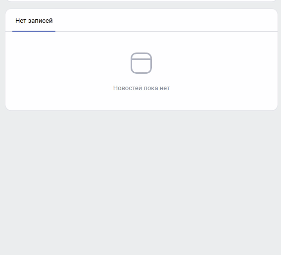

# Публикация комиксов в группе VK.

## Установка

- Скачайте код.
- Установите актуальную версию poetry в `UNIX`-подобных дистрибутивах с помощью команды:
```
curl -sSL https://install.python-poetry.org | python3 -
```
или в `Windows Powershell`:
```
(Invoke-WebRequest -Uri https://install.python-poetry.org -UseBasicParsing).Content | py -
```
- Добавьте к переменной окружения `$PATH` команду poetry:
```
source $HOME/.poetry/bin
```
- Установите виртуальное окружение в директории с проектом командой:
```
poetry config virtualenvs.in-project true
```
- Установите все зависимости (для установки без dev зависимостей можно добавить аргумент `--no-dev`):
```
poetry install
```
- Активируйте виртуальное окружение командой: 
```
source .venv/bin/activate
```

## Настройка переменных окружения

- Cоздайте файл `.env` в директории проекта, на основе файла `.env.example` командой 
(при необходимости скорректируйте значения переменных окружения):
```
cp .env.example .env
```
<details>
  <summary>Переменные окружения</summary>
  <pre>
    COMICS_PATH=comics
    XKCD_BASE_URL=https://xkcd.com
    XKCD_BASE_URI=/info.0.json
    VK_API_URL=https://api.vk.com/method/
    VK_ACCESS_TOKEN=
    VK_GROUP_ID=
    RETRY_COUNT=5
    TIMEOUT=10
    STATUS_FORCE_LIST=429,500,502,503,504
    ALLOWED_METHODS=HEAD,GET,OPTIONS
    LOGGING_LEVEL=ERROR
  </pre>
</details>

*** Необходимо сначала создать [новое сообщество в VK](https://vk.com/groups?tab=admin), а также [standalone-приложение](https://vk.com/apps?act=manage). Нужен будет `client_id` приложения. ***

*** Для работы c VK API необходимо заполнить переменные окружения `VK_ACCESS_TOKEN` и `VK_GROUP_ID`. Подробности на [vk.com](https://vk.com/dev/implicit_flow_user).***

*** Потребуются следующие права `photos`, `groups`, `wall` и `offline` для того, чтобы приложение имело доступ к вашему аккаунту и могло публиковать сообщения в группах. ***

## Запуск линтеров

```
isort . && flake8 . && mypy .
```
## Запуск 
- Для публикации комиксов в группе VK вводим команду:
```
 python3 main.py
```

## Пример результата



## Цели проекта
Код написан в образовательных целях на онлайн-курсе для веб-разработчиков [Devman](https://dvmn.org).
